# MARKDOWNENT

Markdown est un langage de balisage simple à lire et écrire, il peut être utilisé afin de créer des pages internet simple type blog par le fait qu'il peut être converti en HTML, écrire des emails mais surtout utilisé afin de créer des documentations type README sur des plateforme type Github. Markdown à bien évidemment pleins d'autres utilités car simple à apprendre et surtout simple à créer car n'importe quel editeur de texte vous permettra de créer un fichier Markdown.

## Le fichier Markdown

Le fichier Markdown afin d'être reconnu doit être terminé par :

> .md, .markdown, .mkd, .mdown, .mdtext, .mdtxt

***
```
ligne 1
pas d'espaces après "ligne 1".

ligne 2**
deux espaces après "ligne 2 ici représenté par des *".
```

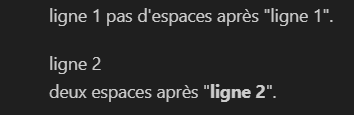

## Les titres

```md
# "Titre Principal"
## "Titre Secondaire" (ne contient plus de séparation en format HTML)
### Texte avec une plus grand police (ne contient pas de séparation)
```

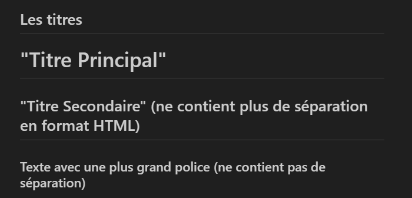

## Les Textes spéciaux

```md
Texte en **GRAS**.
```
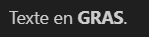

***

```md
Texte en *ITALIQUE*.
```
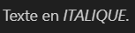

***

```md
Texte en ***GRAS ET ITALIQUE***.
```
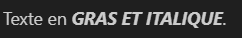

***

```md
Texte ~~BARRE~~.
```
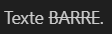

***

```md
Texte ==SURLIGNE== (marche pas tout le temps.)

Texte <mark>SURLIGNE</mark>.
```
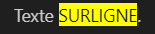

***

```md
Texte <mark style="background:pink">SURLIGNE mais rose</mark>. 
```
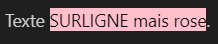


### Notez que si la couleur du surlignage ne fonctionne pas vous devrez ajouter "!important" juste devant la couleur donc ici écrire : **"background:pink!important"**

***

```md
Texte ~en dessous~ (marche pas tout le temps.)

Texte <sub>en dessous</sub>.
```
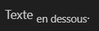

***

```md
Texte ^au dessus^ (marche pas tout le temps.)

Texte <sup>au dessus</sup>.
```
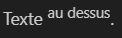

***

```md
Emoji = :smile: (marche pas tout le temps.)
```
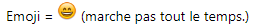

***

```md
Texte pour montrer du code = ``i = 0``.
```
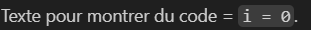

***

```md
> Texte en "quote".
>
>> Commentaire de la quote.
```
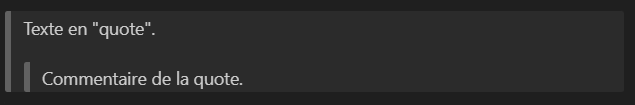

### Separateur/Filet (Notez que les titres et sous titre crée d'office un séparateur.)
***
---

## Les Intégrations

Bloc de Code (Préciser le langage, ici du C)
```md
    ```C 
    char *salut = "Coucou";
    i = 369;

    while (i != 2) {
        i = i - 1;
    }
    return 0;
    //Salut je suis un commentaire.
    ```
```
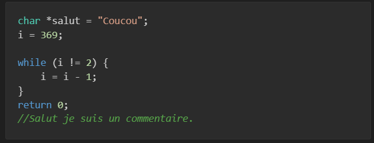

### Hyperlink

```md
[Voici un lien internet.](https://www.youtube.com/watch?v=2tda_TCjz8w)

[Voici un lien vers un autre fichier.](fichier2)
```

[Voici un lien internet.](https://www.youtube.com/watch?v=2tda_TCjz8w)

[Voici un lien vers un autre fichier.](fichier2)

### Image et Gif

### Voici une image , vous noterez que le texte mis entres crochets sera "l'alt text" de l'image. Ici "tripleS" et le texte mis entre parenthèses est le nom du fichier.

```md

```


### Une image animée type gif peut être aussi implémentée. 

```md

```


## Les Liste (Notez que cette liste n'est qu'un exemple, modulez la comme vous le souhaitez !!!)

```md
* Premier objet d'une liste
* Deuxieme objet d'une liste
+ Troisieme objet d'une liste mais celui-ci est un arbre
    * Premier objet de l'arbre
        1. Première note pour le premier objet de l'arbre
        2. Deuxieme note pour le premier objet de l'arbre
    * Deuxieme objet de l'arbre
- Quatrième objet d'une liste
```
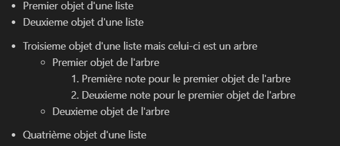

### Autre types de listes les "checkboxes" ou "To Do Lists"

```md
- [ ] Mission 1
- [ ] Mission 2
   - [ ] Mission 2.1 (ça peut être une étapes afin de faire la mission 1 ou ce que vous voulez faites parler votre imaginaire.)
- [X] Mission accomplie
```
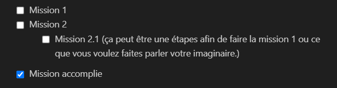

## Les Tables

```md
| Droite | Centre | Gauche |
|-------:|:------:|:-------|
| T1     | T2     | T3     |
```

### Notez que les barres ne sont pas obligées d'être alignées, elles peuvent être totalement non droite c'est juste que c'est plus simple à lire.

```md
| Droite     | Centre | Gauche      |
|-------:|:------:      |:-------    |
| T1   | T2 | T3                   |
```
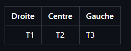